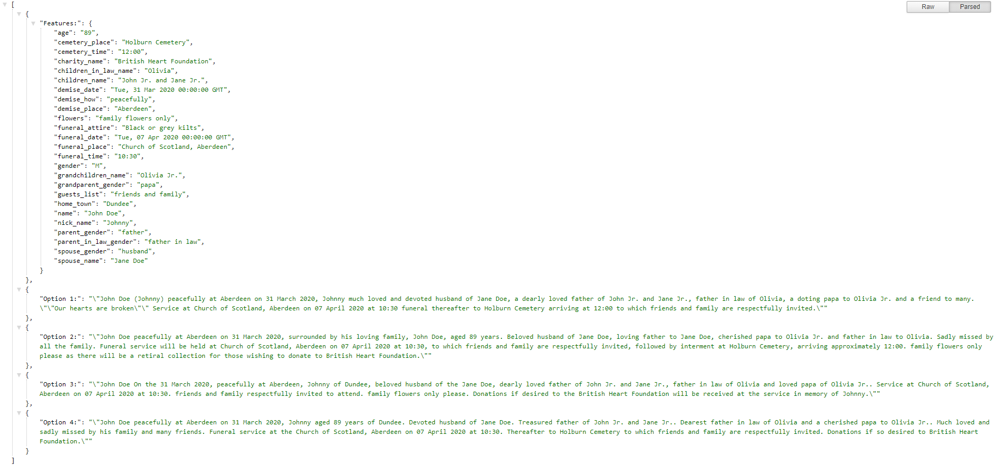
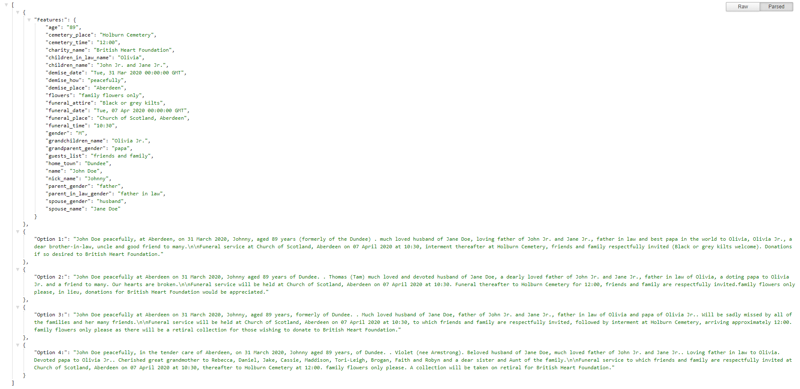

## Instructions to run
- Run on windows powershell
    - ```$env:FLASK_ENV="development"```
    - ```$env:FLASK_APP="cbrobit.py"```
    - ```flask run```

## Input-Output system
- On `https://localhost:5000` there will be a form for different feature values.
- After submitting the form you will get a `json` file with a dictionary of features given as input and four possible obituaries.
- An example of obituaries generated from `basic-retrieval` method.

- An example of obituaries generated from `component-retrieval` method.


## TODO
- ~~Similarity measure in component retrieval.~~ **Done**
- Edge cases:
   - Orthology: Things like one full stops only.
   - ~~Morphology: Things like appropriate use of 'he' or 'she'.~~ **Done**
- Modify the feature list to handle edge-cases.
   - Special care for relations section.
- Maybe break the obituary into two sections, 'funeral' and 'non-funeral', for sending it back.
- Try to add message about previous life.
- ~~Add the framework for data labelling.~~ **Done**
   - ~~First manual labelling in Doccano.~~
   - ~~Second, conversion of Doccano's format into XML.~~
   - ~~Third, conversion of XML into tabular form, i.e., CSV.~~
   - **Imp.**: Right now automated conversion is only supported for `basic-retrieval` method.
- ~~Add a list of features categorised in component type.~~ **Done**

## Longer Goal
- Add more data.
- Add Active Learning for data labelling.

## Directory Tree
```
+-- app (flask sevice)
   +-- messages (CBR/Lazy learning part)
      +-- data (Case-Base)
         +-- 101_funeral_component.csv 
         +-- 101_personal_component.csv 
         +-- 101_relations_component.csv 
         +-- 101_single_component.csv 
      +-- resources 
         +-- feature_list.csv 
      +-- __init__.py
      +-- errors.py
      +-- funeral.py
      +-- main.py
      +-- personal_info.py
      +-- relations.py
      +-- single_comp.py
      +-- README.md
   +-- templates (HTML templates)
         +-- index.html
   +-- __init__.py
   +-- routes.py (flask routes)

+-- labelling (data labelling framewrok)
   +-- data
      +-- basic.csv
      +-- tagged.json1
      +-- xm-tagged.xml
   +-- create_csv.py
   +-- create_xml.py
   +-- README.md

+-- migrations (database: useless)

+-- cbrobit.py (main flask file)
+-- LICENSE
+-- README.md
```

**Note**: Files other than listed here might not be useful.

<!-- ```
|--- cbrservice
|   |--- app 
|       |--- messages 
|           |--- data 
|               |--- 101_funeral_component.csv 
|               |--- 101_personal_component.csv 
|               |--- 101_relations_component.csv 
|               |--- 101_single_component.csv 
|           |--- __init__.py
|           |--- funeral.py
|           |--- main.py
|           |--- personal_info.py
|           |--- relations.py
|           |--- single_comp.py
|       |--- templates 
|               |--- index.html
|       |--- __init__.py
|       |--- routes.py 
|   |--- cbrobit.py
|--- LICENSE
|--- README.md
``` -->
